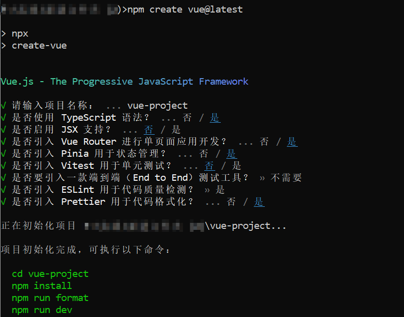

基于 vite 搭建 vue3 + typescript + vue-router + pinia 的基础项目

# 前提

- **nodejs**  
  熟悉命令行 ，已安装 18.3 或更高版本的 Node.js  
  [Node.js 官网](https://nodejs.org/zh-cn/)  
  [Node.js 安装教程](https://www.cnblogs.com/matanzhang/p/11441693.html)

# 创建项目

```bash
# 使用 npm
npm create vite@latest

# 使用 pnpm
pnpm create vite@latest

# 使用 yarn
yarn create vite@latest
```


Typescript:  
Vue Router: 官方的路由库。  
Pinia: 官方的状态管理库。  
Eslint: 静态代码分析工具，管理代码规范。(初学可以不使用)  
Prettier: 代码格式化工具。(初学可以不使用)

# 项目运行

1. 安装依赖

```bash
npm install
```

2. 启动项目

```bash
npm run dev
```

# 项目结构

├── node_modules 依赖包  
├── README.md 项目描述  
├── public 公共资源  
├── vite.config.ts vite 配置文件  
├── package.json 依赖包信息  
├── index.html 入口文件  
├── src 源代码  
│ ├── App.vue 根组件  
│ ├── main.ts 项目入口文件  
│ ├── router 路由  
│ │ ├── index.ts 路由配置文件  
│ ├── stores 状态管理  
│ │ ├── index.ts 状态管理配置文件  
│ ├── views | pages 页面  
│ │ └── Home.vue 首页  
│ ├── layout 布局  
│ │ └── index.vue 布局组件  
│ │ └── components 组件  
│ ├── types 类型声明  
│ │ └── index.d.ts 全局类型声明文件  
│ ├── utils 工具函数  
│ │ └── index.ts  
│ ├── styles 样式  
│ │ ├── index.css 全局样式  
│ ├── config 配置文件  
│ │ └── index.ts  
│ ├── api | interfaces 接口  
│ ├── assets 静态资源  
│ │ └── logo.png  
│ ├── components 组件  
│ │ ├── HelloWorld.vue  
│
